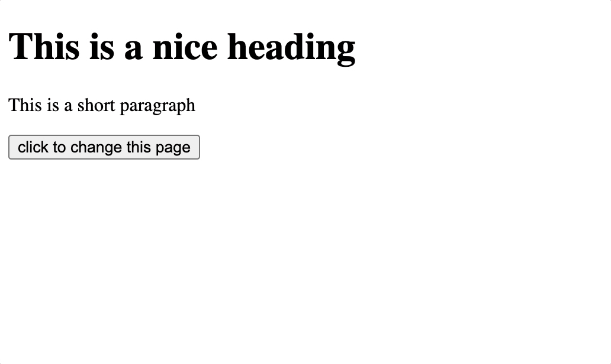

# Assignment: Animating HTML with D3

*PLEASE READ THIS **ENTIRE** DOCUMENT FIRST*

* [the assignment](#the-assignment)
* [submitting-your-work](#submitting-your-work)

## The assignment

Download this repo and edit the Javascript inside `index.html`.

* You'll find some existing D3 code inside the script tags. Put your code only in the `animatePage()` function.
* With D3 code, remove all spans in the page
* With D3 code, animate the heading so it transitions from black to hotpink color, in 4 seconds. After changing the color, animate the `margin-bottom` property so it goes to `100px`.
* With D3 code, animate the `margin-left` property of the paragraph to `100px`. Do not set up any duration (the default 250ms will be used).
* The endresult should look like this:

Make sure this project works locally.

## Submitting your work
Create a new branch called **gh-pages** and upload your local work into this branch.
Start a new **pull request**, select one **reviewer** and make sure to put the **GitHub Pages URL** in the comment section. Do **not** merge this Pull Request yourself. That's up to the reviewer to decide (merging is approving the assignment).
